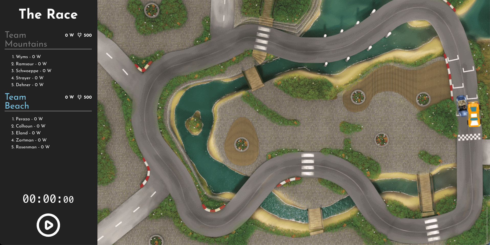
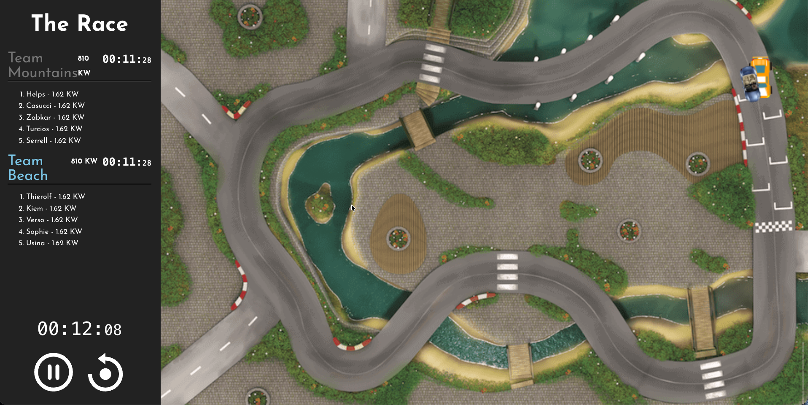
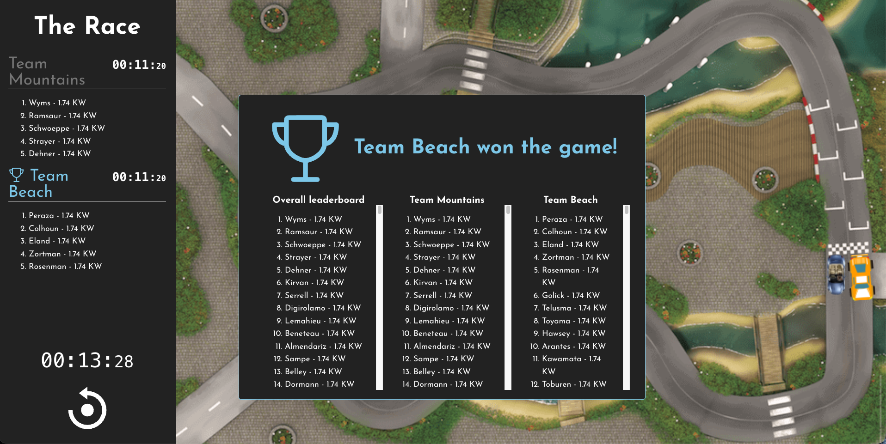
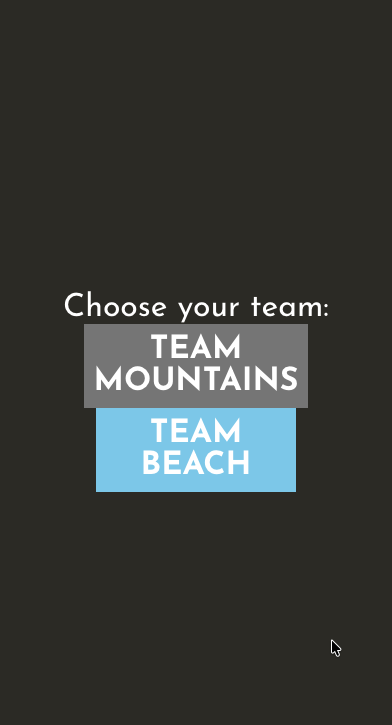
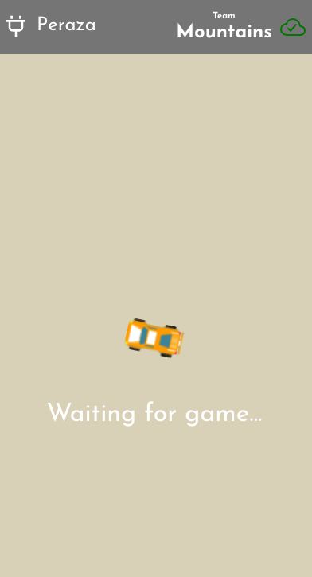
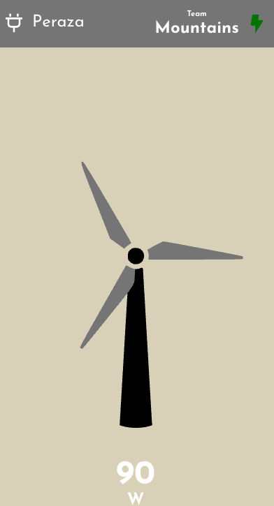
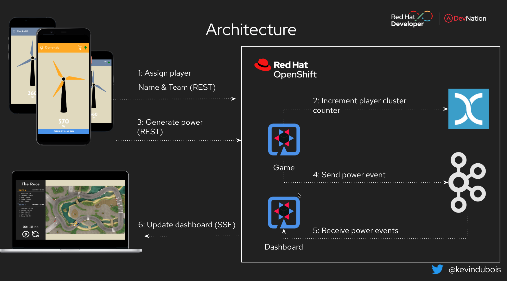
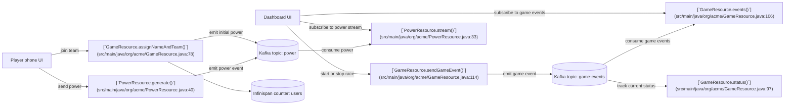

# Quinoa WindTurbine Racer Demo

This project uses Quarkus, the Supersonic Subatomic Java Framework.

The application is a small race game. Players join one of two teams, charge their turbines and send power during the race. The dashboard shows the race as it happens and the winning team at the end.

## The game

Before the race starts, players join and wait for the race to begin.



During the race, both teams generate power and the cars move across the track.



At the end of the race, the dashboard shows the winner.



### Player view

On their phone, players first choose a team.



After joining, they wait for the game to start.



When the race is running, they generate "power" from the mobile screen by either tapping, shaking, blowing or swiping.



## Architecture



The application has two browser entry points. The player screen is used on the phone, and the dashboard is used by the game operator. Both talk to the Quarkus backend. Game state and power events are sent through Kafka, while Infinispan is used for counters and shared state.



A player joins through the main UI at the root of the domain, receives a generated name and team, and an initial event is written to the Kafka `power` topic. During the race, the mobile client sends power updates to [`/api/power/`](src/main/java/org/acme/PowerResource.java:38), which publishes more messages to the same topic.

The dashboard (/dashboard) listens to two backend streams. [`/api/game/events`](src/main/java/org/acme/GameResource.java:102) delivers the game lifecycle events from the Kafka `game-events` topic, and [`/api/power/stream`](src/main/java/org/acme/PowerResource.java:28) delivers grouped power events from the Kafka `power` topic. When the operator starts the race from the dashboard, the backend writes a game event to the `game-events` topic, and the connected clients react to that change.

## Running the application in dev mode

Install first:

- JDK 25

You can run your application in dev mode that enables live coding using:

```bash
./mvnw quarkus:dev
```

If you already have the Quarkus CLI installed, you can also use:

```bash
quarkus dev
```

The application is available on `http://localhost:8080`.

The dashboard is available on `http://localhost:8080/dashboard`.

## Testing the game in dev mode

The project includes a small load script in [`scripts/GameLoader.java`](scripts/GameLoader.java:34). It assigns players, waits for the game to start and then sends power events to the backend. This is useful when you want to exercise the game locally without using real phones or browsers for every player.

The script is written as a jbang script. If you have jbang installed, start the application in dev mode first and then run:

```bash
jbang scripts/GameLoader.java http://localhost:8080
```

By default the script creates 50 players and sends 100 power events for each player.

You can change the number of players, the number of clicks and the power value:

```bash
jbang scripts/GameLoader.java http://localhost:8080 --players 20 --clicks 50 --power 15
```

Open the dashboard while the script is running and hit the start button in the bottom left:

```text
http://localhost:8080/dashboard
```

## Customizing the game

The main game settings are in [`src/main/webui/src/Config.js`](src/main/webui/src/Config.js:1).

Team names, colors and car images are defined in [`TEAMS_CONFIG`](src/main/webui/src/Config.js:8). Update the `name`, `color` and `car` fields for each team to change how the game looks on the dashboard and on the player screen.

The available car image names are listed in the comment above [`TEAMS_CONFIG`](src/main/webui/src/Config.js:7).

The dashboard game dynamics are controlled by [`TAP_POWER`](src/main/webui/src/Config.js:22), [`NB_TAP_NEEDED_PER_USER`](src/main/webui/src/Config.js:23) and [`SHOW_TOP`](src/main/webui/src/Config.js:24). These values change how much power each action produces, how many taps are needed per player and how many players are shown in the ranking.

The player controls are enabled in the same file with [`ENABLE_TAPPING`](src/main/webui/src/Config.js:27), [`ENABLE_SHAKING`](src/main/webui/src/Config.js:28), [`ENABLE_BLOWING`](src/main/webui/src/Config.js:29) and [`ENABLE_SWIPING`](src/main/webui/src/Config.js:30). This lets you switch between the different interaction modes used by the game.

When the application is running in dev mode, changes in [`src/main/webui/src/Config.js`](src/main/webui/src/Config.js:1) are picked up automatically.

## Running with a container image

Build the application first:

```bash
./mvnw package
```

Then build the container image:

```bash
docker build -f src/main/docker/Dockerfile.jvm -t quarkus/quinoa-wind-turbine-jvm .
```

Run the image with:

```bash
docker run -i --rm -p 8080:8080 quarkus/quinoa-wind-turbine-jvm
```

## Deploy on OpenShift

There are two ways to deploy this demo on OpenShift.

If you want to deploy the application directly from Quarkus, see the section below.

If you want the full demo setup with GitOps, pipelines, Kafka and Infinispan, see [OpenShift installation](docs/openshift-install.md) and [GitOps and pipeline setup](docs/gitops-pipeline.md).

## When deploying from Quarkus

### Copy sandbox OpenShift resource file

```bash
cp src/main/kubernetes/openshift.cluster.yml src/main/kubernetes/openshift.yml
```

### Deploy

```bash
quarkus build -Dquarkus.kubernetes.deploy=true -Dquarkus.profile=openshift-cluster -Dquarkus.container-image.group=[project name]
```

### Update

```bash
quarkus build -Dquarkus.container-image.build=true -Dquarkus.profile=openshift-cluster -Dquarkus.container-image.group=[project name]
```

### Delete deployed app

```bash
oc delete all -l app.kubernetes.io/name=quinoa-wind-turbine
